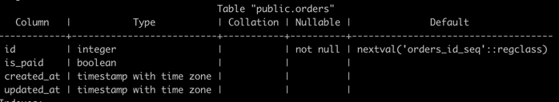

The `TemplateRecord` transformer allows you to modify records using a Go template and apply changes via the PostgreSQL
driver. This transformer provides a way to implement custom transformation logic.

## Parameters

| Name     | Description                                                                                                                                                     | Default | Required | Supported DB types |
|----------|-----------------------------------------------------------------------------------------------------------------------------------------------------------------|---------|----------|--------------------|
| columns  | A list of columns that are supposed to be affected by the template. The list of columns will be checked for constraint violations.                              |         | No       | any                |
| template | A Go template string                                                                                                                                            |         | Yes      | -                  |
| validate | Validate the template result via PostgreSQL driver decoding procedure. This may cause an error if a custom type does not have an encode-decoder implementation. | false   | No       | -                  |

## Description

The `TemplateRecord` transformer utilizes Go templates. Go's template system is designed to be extensible, enabling
developers to access data objects and incorporate custom functions programmatically. For more information, you can refer
to the official  [Go Template documentation](https://pkg.go.dev/text/template). It's the perfect way to implement your
own multi-column transformation logic.

The `TemplateRecord` transformer operates with Record. You can easily manage and discover the data using provided
driver functions. This allows you to **implement complicated transformation logic** using pre-defined template
functions.

**Pros:**

* Easy to implement
* No needs to deploy external transformer
* Custom transformation can be implemented with functional dependencies - when one column value depends on another.
  For instance `created_at` and `updated_at` - `updated_at` value must be after `created_at`
* Can be transformed more than one column in template

**Cons:**

* You can use only provided functions
* Difficult to debug, though using `validate` command you can check the result in the moment

The `TemplateRecord` transformer is distinct from the `Template` transformer. The `Template` transformer applies the Go
template result to the provided column, while `TemplateRecord` does not use the template result. Instead, the
user-defined template is able to apply the value via driver using functions `.SetValue` or `.SetRawValue`.

For more information about available template functions, refer to the [functions and hints](../template_functions.md).

### Template functions

PostgreSQL driver functions provided by the `TemplateRecord` transformer include:

#### .GetColumnType

Returns a string with the column type.

Signature:

`.GetColumnType(name string) (typeName string, err error)`

Parameters:

* `name` - the name of the column

Return Value:

* `typeName` - The string representing the column type.
* `err` - An error if there's an issue

Example

```gotemplate
{{ .GetColumnType "created_at" }}
```

#### .GetColumnValue

Returns a value for a specific column, encoded by PostgreSQL driver into any type and error It might be on
of `int`, `float`, `time`, `string`, `bool` and `slice` or `map` of any type

Signature:

`.GetColumnValue(name string) (value any, err error)`

Parameters:

* `name` - the name of the column

Return Value:

* `value` - any type that was encoded from original raw value into golang type. Usually it is `int`, `float`, `time`,
  `string`, `bool` and `slice` or `map` of any type
* `err` - An error if there's an issue

Example

```gotemplate
{{ .GetColumnValue "created_at" }}
```

#### .GetRawColumnValue

Returns a raw value as a string for a specific column.

Signature:

`.GetRawColumnValue(name string) (value string, err error)`

Parameters:

* `name` - the name of the column

Return Value:

* `value` - A string raw value
* `err` - An error if there's an issue

Example

```gotemplate
{{ .GetRawColumnValue "created_at" }}
```

#### .SetColumnValue

Set a new value of a specific data type to the column. The value assigned **must be compatible** with the PostgreSQL
data type of the column. For example, it is allowed to assign an `int` value to an `INTEGER` column, but you cannot
assign a `float` value to a `timestamptz` column.

Signature:

`.GetRawColumnValue(name string, value any) (err error)`

Parameters:

* `name` - The name of the column
* `value` - A new value of a specific data type

Return Value:

* `err` - An error if there's an issue

Example:

```gotemplate
{{ .SetColumnValue 13 "items_amount" }}
```

#### .SetRawColumnValue

Set a new raw value that literally is compatible with type.

!!! warning

    Crefully use `.SetRawColumnValue` function as it may lead to errors when restoring the database dump if the 
    assigned value is not compatible with the column type. To ensure compatibility, consider using the 
    `.DecodeValueByColumn` function followed by `.SetColumnValue`:
      ```gotemplate
      {{ "13" | .DecodeValueByColumn "items_amount" | .SetColumnValue "items_amount" }}
      ```

Signature:

`.SetRawColumnValue(name string, value any) (err error)`

Parameters:

* `name` - The name of the column
* `value` - A new raw value, represented as a string or Null value.

Return Value:

* `err` - An error if there's an issue

Example:

```gotemplate
{{ "2023-12-17 17:50:51.047118+00" | .SetRawColumnValue "created_at" }}
{{ Null | .SetRawColumnValue "updated_at" }}
```

#### .EncodeValueByColumn

Encode a value of any type into its raw string representation using the specified column name. This encoding operation
is carried out through the PostgreSQL driver. Causes an error if the type is not compatible with column type.

Signature:

`.EncodeValueByColumn(name string, value any) (res any, err error)`

Parameters:

* `name` - The name of the column
* `value` - A value of a specific data type

Return Value:

* `res` - A raw value, represented as a string or Null value.
* `err` - An error if there's an issue

In this example, an integer value `123` is converted into the string `"123"` using `item_amount` column type.
The string `"123"` is concatenated with `"456"` . The resulting value `"123456"` is then assigned as a raw value to
the `item_amount` column.

```gotemplate
{{ 123 | .EncodeValueByColumn "item_amount" | cat "567" | .SetRawColumnValue "item_amount" }}
```

#### .DecodeValueByColumn

Decode a value from its raw string representation to a Golang type using the specified column name. This decoding
operation is executed through the PostgreSQL driver and may result in an error if the type is not compatible with the
column type.

Signature:

`.DecodeValueByColumn(name string, value any) (res any, err error)`

Parameters:

* `name` - The name of the column
* `value` - A raw value, represented as a string or Null value.

Return Value:

* `res` - A value of a specific data type
* `err` - An error if there's an issue

Example:

In this example, a raw value `"2023-12-17 18:50:34.277372+00"` is decoded into assisted type (`timestamptz`) using
column `created_at`, and the result is assigned to the `created_at` column using the `.SetColumnValue` function. In this
example, the new column is safely assigned using driver decoding. If there is an error in the raw string value,
the `.DecodeValueByColumn` function returns an error.

```gotemplate
{{ "2023-12-17 18:50:34.277372+00" | .DecodeValueByColumn "created_at" | .SetColumnValue "created_at" }}
```

#### .EncodeValueByType

Encode a value of any type into its string representation using the specified type name. This encoding operation
is carried out through the PostgreSQL driver and may result in an error if the type is not compatible with the column
type.

Signature:

`.EncodeValueByType(name string, value any) (res any, err error)`

Parameters:

* `name` - The encoding type name
* `value` - A value of a specific data type

Return Value:

* `res` - A raw value, represented as a string or Null value.
* `err` - An error if there's an issue

In this example, an integer value `123` is converted into the string `"123"` using `int` PostgreSQL type.
The string `"123"` is concatenated with `"456"` . The resulting value `"123456"` is then assigned as a raw value to
the `item_amount` column.

```gotemplate
{{ 123 | .EncodeValueByType "int" | cat "567" | .SetRawColumnValue "item_amount" }}
```

#### .DecodeValueByType

Decode a value from its raw string representation to a Golang type using the specified type name. This decoding
operation is performed through the PostgreSQL driver and may result in an error if the type is not compatible with the
column type.

Signature:

`.DecodeValueByType(name string, value any) (res any, err error)`

Parameters:

* `name` - The encoding type name
* `value` - A raw value, represented as a string or Null value.

Return Value:

* `res` - A value of a specific data type
* `err` - An error if there's an issue

Example:

In this example, a raw value `"2023-12-17 18:50:34.277372+00"` is decoded into assisted type using type `timestamptz`,
and the result is assigned to the `created_at` column using the `.SetColumnValue` function. In this
example, the new column is safely assigned using driver decoding. If there is an error in the raw string value,
the `.DecodeValueByColumn` function returns an error.

```gotemplate
{{ "2023-12-17 18:50:34.277372+00" | .DecodeValueByType "timestamptz" | .SetColumnValue "created_at" }}
```

## Examples

### A. Generate a random created_at and updated_at dates

Table structure



In this scenario, we aim to modify the `"created_at"` and `"updated_at"` columns based on the following rules:

* Do not change the value if the `created_at` is Null.
* If the `created_at` is not null, generate the current time and use it as the minimum threshold for randomly
  generating the `updated_at` value.
* Assign all generated values using the `.SetColumnValue` function.

```

``` yaml 
- name: "TemplateRecord"
  params:
    columns:
      - "created_at"
      - "updated_at"
    template: >
      {{ $val := .GetColumnValue "created_at" }}
      {{ if isNotNull $val }}
          {{ $createdAtValue := now }}
          {{ $maxUpdatedDate := date_modify "24h" $createdAtValue }}
          {{ $updatedAtValue := randomDate $createdAtValue $maxUpdatedDate }}
          {{ .SetColumnValue "created_at" $createdAtValue }}
          {{ .SetColumnValue "updated_at" $updatedAtValue }}
      {{ end }}
    validate: true
```

Expected results:

| column name | original value                | transformed                 |
|-------------|-------------------------------|-----------------------------|
| created_at  | 2021-01-20 07:01:00.513325+00 | 2023-12-17 19:37:29.910054Z |
| updated_at  | 2021-08-09 21:27:00.513325+00 | 2023-12-18 10:05:25.828498Z |


