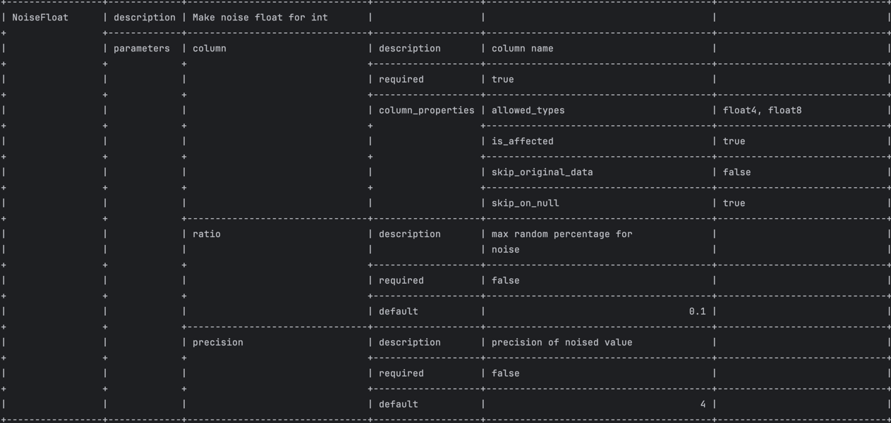

# Commands

`greenmask --log-format=[json|text] --log-level=[debug|info|error] --config=config.yml 
[dump|list-dumps|delete|list-transformers|restore|show-dump]`

## common parameters
* **--log-format** - format of log output [json|text]. Is not required. Default text.
* **--log-level** - level of log output [debug|info|error]. Is not required. Default info.
* **--config** - config file in yaml format. Is required.
* **--help** - print help for greenmask

## validate
Perform validation procedure and data diff of transformation

```text title="list of the all supported parameters"
Usage:
  greenmask validate [flags]

Flags:
      --data              perform test dump for --rows-limit rows and print it pretty
      --diff              find difference between original and transformed data
      --format string     format of table output. possible values [horizontal|vertical] (default "horizontal")
      --rows-limit uint   check tables dump only for specific tables (default 10)
      --table strings     check tables dump only for specific tables
```

The parameter `--table` may be written more than once. The table may be written either with schema name 
(`public.tatble_name`) or without schema `table_name`. If there is more than one tables in different schemas an error
will be thrown.


There is the validation call `greenmask --config=config.yml dump --validate`:
```text title="example of validation output"
2023-10-30T11:19:28+02:00 WRN ValidationWarning={"meta":{"ColumnName":"scheduled_departure","ConstraintDef":"CHECK (scheduled_arrival \u003e scheduled_departure)","ConstraintName":"bookings","ConstraintSchema":"bookings","ConstraintType":"Check","ParameterName":"column","SchemaName":"bookings","TableName":"flights","TransformerName":"RandomDate"},"msg":"possible constraint violation: column has Check constraint","severity":"warning"}
2023-10-30T11:19:28+02:00 WRN ValidationWarning={"meta":{"ColumnName":"scheduled_departure","ConstraintDef":"UNIQUE (flight_no, scheduled_departure)","ConstraintName":"bookings","ConstraintSchema":"bookings","ConstraintType":"Unique","ParameterName":"column","SchemaName":"bookings","TableName":"flights","TransformerName":"RandomDate"},"msg":"possible constraint violation: column is involved into Unique constraint","severity":"warning"}
2023-10-30T11:19:28+02:00 WRN ValidationWarning={"meta":{"ColumnName":"scheduled_arrival","ConstraintDef":"CHECK (scheduled_arrival \u003e scheduled_departure)","ConstraintName":"bookings","ConstraintSchema":"bookings","ConstraintType":"Check","ParameterName":"column","SchemaName":"bookings","TableName":"flights","TransformerName":"NoiseDate"},"msg":"possible constraint violation: column has Check constraint","severity":"warning"}
2023-10-30T11:19:28+02:00 WRN ValidationWarning={"meta":{"ColumnName":"departure_airport","ConstraintDef":"FOREIGN KEY (departure_airport) REFERENCES airports_data(airport_code)","ConstraintName":"bookings","ConstraintSchema":"bookings","ConstraintType":"ForeignKey","ParameterName":"column","SchemaName":"bookings","TableName":"flights","TransformerName":"RegexpReplace"},"msg":"possible constraint violation: column is involved into ForeignKey constraint","severity":"warning"}
2023-10-30T11:19:28+02:00 WRN ValidationWarning={"meta":{"ColumnName":"status","ConstraintDef":"CHECK (status::text = ANY (ARRAY['On Time'::character varying::text, 'Delayed'::character varying::text, 'Departed'::character varying::text, 'Arrived'::character varying::text, 'Scheduled'::character varying::text, 'Cancelled'::character varying::text]))","ConstraintName":"bookings","ConstraintSchema":"bookings","ConstraintType":"Check","ParameterName":"column","SchemaName":"bookings","TableName":"flights","TransformerName":"RegexpReplace"},"msg":"possible constraint violation: column has Check constraint","severity":"warning"}
2023-10-30T11:19:28+02:00 WRN ValidationWarning={"meta":{"ColumnName":"post_code","ParameterName":"column","SchemaName":"bookings","TableName":"flights","TransformerName":"Replace","TypeName":"column"},"msg":"transformer may produce NULL values but column type has NOT NULL constraint","severity":"warning"}
2023-10-30T11:19:28+02:00 WRN ValidationWarning={"meta":{"Column":"actual_arrival","ColumnMaxLength":-1,"ConstraintType":"Length","Parameter":"column_b","SchemaName":"bookings","TableName":"flights","TransformerMaxLength":0,"TransformerName":"TwoDatesGen"},"msg":"transformer value might be out of length range: column has a length","severity":"warning"}
2023-10-30T11:19:28+02:00 WRN ValidationWarning={"meta":{"ColumnName":"actual_arrival","ConstraintDef":"CHECK (actual_arrival IS NULL OR actual_departure IS NOT NULL AND actual_arrival IS NOT NULL AND actual_arrival \u003e actual_departure)","ConstraintName":"bookings","ConstraintSchema":"bookings","ConstraintType":"Check","ParameterName":"column_b","SchemaName":"bookings","TableName":"flights","TransformerName":"TwoDatesGen"},"msg":"possible constraint violation: column has Check constraint","severity":"warning"}
2023-10-30T11:19:28+02:00 WRN ValidationWarning={"meta":{"Column":"scheduled_arrival","ConstraintType":"NotNull","Parameter":"column_a","SchemaName":"bookings","TableName":"flights","TransformerName":"TwoDatesGen"},"msg":"transformer may produce NULL values but column has NOT NULL constraint","severity":"warning"}
2023-10-30T11:19:28+02:00 WRN ValidationWarning={"meta":{"Column":"scheduled_arrival","ColumnMaxLength":-1,"ConstraintType":"Length","Parameter":"column_a","SchemaName":"bookings","TableName":"flights","TransformerMaxLength":0,"TransformerName":"TwoDatesGen"},"msg":"transformer value might be out of length range: column has a length","severity":"warning"}
2023-10-30T11:19:28+02:00 WRN ValidationWarning={"meta":{"ColumnName":"scheduled_arrival","ConstraintDef":"CHECK (scheduled_arrival \u003e scheduled_departure)","ConstraintName":"bookings","ConstraintSchema":"bookings","ConstraintType":"Check","ParameterName":"column_a","SchemaName":"bookings","TableName":"flights","TransformerName":"TwoDatesGen"},"msg":"possible constraint violation: column has Check constraint","severity":"warning"}
2023-10-30T11:19:28+02:00 WRN ValidationWarning={"meta":{"ColumnName":"range","ConstraintDef":"CHECK (range \u003e 0)","ConstraintName":"bookings","ConstraintSchema":"bookings","ConstraintType":"Check","ParameterName":"column","SchemaName":"bookings","TableName":"aircrafts_data","TransformerName":"NoiseInt"},"msg":"possible constraint violation: column has Check constraint","severity":"warning"}
```

Each line contains nested json by key `ValidationWarning` with detailed information for determining the part of
configuration and potential constraints that might be violated.

``` json title="pretty formatted validation warning"
{
  "meta": { // (1)
    "ColumnName": "status", // (2)
    "ConstraintDef": "CHECK (status::text = ANY (ARRAY['On Time'::character varying::text, 'Delayed'::character varying::text, 'Departed'::character varying::text, 'Arrived'::character varying::text, 'Scheduled'::character varying::text, 'Cancelled'::character varying::text]))", // (3)
    "ConstraintName": "bookings", // (4)
    "ConstraintSchema": "bookings", // (5)
    "ConstraintType": "Check", // (6)
    "SchemaName": "bookings", // (7)
    "TableName": "flights", // (8) 
    "TransformerName": "RegexpReplace", // (9)
    "ParameterName": "column" // (10)
  },
  "msg": "possible constraint violation: column has Check constraint", // (11)
  "severity": "warning" // (12)
}
```
{ .annotate }

1. Detailed metadata for determining the source of problems
2. Column name
3. Constraint definition
4. Constraint name
5. Constraint schema name
6. Type of constraint. Can be one of the:
   ```
   * ForeignKey
   * Check
   * NotNull
   * PrimaryKey
   * PrimaryKeyReferences
   * Unique
   * Length
   * Exclusion
   * TriggerConstraint
   ```
7. Table schema name
8. Table name
9. Transformer name
10. Name of affected parameter. Usually, it is a column parameter
11. Validation warning description
12. Severity of validation warning. Can be one of
    ```
    * error
	* warning
	* info
	* debug
    ```

!!! note

    A validation warning with `severity=error` is fatal and dump operation cannot be performed until this warning is not 
    solved


An example of validation diff in vertical format (`--format=vertical`):


It is printed pretty in table format. The red column background means that the column is affected. The green value is
the original value before transformation the red is the value after transformation. The result might be either in
`horizontal` or `vertical` format

An example of validation diff in horizontal format (`--format=horizontal`):


In horizontal format the first line is original the second is transformed. Colors behavior remains the same as
in **vertical**.

## dump
Perform dump and validate and apply the transformation, put dumped data into defined storage

``` text title="list of the all supported parameters"
Usage:
  greenmask dump [flags]

Flags:
  -b, --blobs                           include large objects in dump
  -c, --clean                           clean (drop) database objects before recreating
  -Z, --compress int                    compression level for compressed formats (default -1)
  -C, --create                          include commands to create database in dump
  -a, --data-only                       dump only the data, not the schema
  -d, --dbname string                   database to dump (default "postgres")
      --disable-dollar-quoting          disable dollar quoting, use SQL standard quoting
      --disable-triggers                disable triggers during data-only restore
      --enable-row-security             enable row security (dump only content user has access to)
  -E, --encoding string                 dump the data in encoding ENCODING
  -N, --exclude-schema strings          dump the specified schema(s) only
  -T, --exclude-table strings           do NOT dump the specified table(s)
      --exclude-table-data strings      do NOT dump data for the specified table(s)
  -e, --extension strings               dump the specified extension(s) only
      --extra-float-digits string       override default setting for extra_float_digits
  -f, --file string                     output file or directory name
  -h, --host string                     database server host or socket directory (default "/var/run/postgres")
      --if-exists                       use IF EXISTS when dropping objects
      --include-foreign-data strings    use IF EXISTS when dropping objects
  -j, --jobs int                        use this many parallel jobs to dump (default 1)
      --load-via-partition-root         load partitions via the root table
      --lock-wait-timeout int           fail after waiting TIMEOUT for a table lock (default -1)
  -B, --no-blobs                        exclude large objects in dump
      --no-comments                     do not dump comments
  -O, --no-owner string                 skip restoration of object ownership in plain-text format
  -X, --no-privileges                   do not dump privileges (grant/revoke)
      --no-publications                 do not dump publications
      --no-security-labels              do not dump security label assignments
      --no-subscriptions                do not dump subscriptions
      --no-sync                         do not wait for changes to be written safely to dis
      --no-synchronized-snapshots       do not use synchronized snapshots in parallel jobs
      --no-tablespaces                  do not dump tablespace assignments
      --no-toast-compression            do not dump TOAST compression methods
      --no-unlogged-table-data          do not dump unlogged table data
      --on-conflict-do-nothing          add ON CONFLICT DO NOTHING to INSERT commands
  -p, --port int                        database server port number (default 5432)
      --quote-all-identifiers           quote all identifiers, even if not key words
  -n, --schema strings                  dump the specified schema(s) only
  -s, --schema-only string              dump only the schema, no data
      --section string                  dump named section (pre-data, data, or post-data)
      --serializable-deferrable         wait until the dump can run without anomalies
      --snapshot string                 use given snapshot for the dump
      --strict-names                    require table and/or schema include patterns to match at least one entity each
  -S, --superuser string                superuser user name to use in plain-text format
  -t, --table strings                   dump the specified table(s) only
      --test string                     connect as specified database user (default "postgres")
      --use-set-session-authorization   use SET SESSION AUTHORIZATION commands instead of ALTER OWNER commands to set ownership
  -U, --username string                 connect as specified database user (default "postgres")
  -v, --verbose string                  verbose mode
```


## list-dumps
List all dumps that are stored in the storage.

Example of output:


Listing attributes:

* **ID** - id of the dump used for performing operations `restore`, `delete`, `show-dump`
* **DATE** - date snapshot date
* **DATABASE** - name of database
* **SIZE** - original size of dump
* **COMPRESSED SIZE** - size of dump after compression
* **DURATION** - duration of dump procedure
* **TRANSFORMED** - is this dump transformed
* **STATUS** - status of dump. There is only two statuses:
  * done - dump completed successfully
  * unknown or failed - dump might be in progress now or failed. Failed dumps are not deleted automatically

## list-transformers
List of the allowed transformers either built-it or custom. It might be helpful for searching for an appropriate
transformer for your transformation.

Parameters:

* **--format** - selection of output format. There might be two options `text` or `json`.
  Text returns formatted table column-oriented. The default setting is text.

Example of output:




Listing attributes:

* **name** of transformers:
* **description** - brief description of transformer
* **parameters** - list of transformer parameters

Each parameter has the next attributes:

* **description** - brief description of parameter
* **required** - flag shows that parameters are required for providing
* **link_parameter** - shows that the value of the parameter will be encoded using a parameter type encoder. For instance, we
  have a parameter with the name "column" and we have a parameter "start" that is linked to the "column" parameter. Once
  the transformer is initialized the value of "start" will be encoded according to the "column" type
* **cast_db_type** - the value will be encoded according to the database type. For instance, in INTERVAL you have to
  provide interval value in Postgresql format.
* **default_value** - default value of a parameter if not provided.
* **column_properties** - if a parameter is the name of a column, then it contains column properties, such as:
  * **nullable** - transformer may produce NULL values, that would violate the NOT NULL constraint
  * **unique** - transformer values are unique for each call. If true shows that the transformer cannot violate the UNIQUE constraint
  * **affected** - is column affected in transformation. If not the value might be needed for transforming another column
  * **allowed_types** - A list of types with this parameter can work
  * **skip_original_data** - though this column is going to be transformed the original value does not make sense
  * **skip_on_null** - skip transformation on null input. This means that interaction with the transformer is not needed if the
    column value is NULL

The json call `greenmask --config=config.yml list-transformers --foramt=json` has the same attributes

``` json title="json format of output"
[
  {
    "properties": {
      "name": "TwoDatesGen",
      "description": "Generate diff between two dates",
      "is_custom": true
    },
    "parameters": [
      {
        "name": "column_a",
        "description": "test1",
        "required": true,
        "is_column": true,
        "column_properties": {
          "affected": true,
          "allowed_types": [
            "date",
            "timestamp",
            "timestamptz"
          ],
          "skip_on_null": false
        }
      },
      {
        "name": "column_b",
        "description": "test2",
        "required": true,
        "is_column": true,
        "column_properties": {
          "affected": true,
          "allowed_types": [
            "date",
            "timestamp",
            "timestamptz"
          ],
          "skip_on_null": false
        }
      }
    ]
  }
]
```

!!! warning

    The default value in json format is base64 encoded. This might be fixed later

## restore
Perform dump restoration with the provided dump ID `greenmask --config=config.yml restore 1695763318739`. The latest completed dump might be
restored with "latest" value provided `greenmask restore latest`.

`restore` command has the same parameters and environment variable as pg_restore

``` text title=""
Flags:
  -c, --clean                           clean (drop) database objects before recreating
  -C, --create                          create the target database
  -a, --data-only                       restore only the data, no schema
  -d, --dbname string                   connect to database name (default "postgres")
      --disable-triggers                disable triggers during data-only restore
      --enable-row-security             enable row security
  -N, --exclude-schema strings          do not restore objects in this schema
  -e, --exit-on-error                   exit on error, default is to continue
  -f, --file string                     output file name (- for stdout)
  -P, --function strings                restore named function
  -h, --host string                     database server host or socket directory (default "/var/run/postgres")
      --if-exists                       use IF EXISTS when dropping objects
  -i, --index strings                   restore named index
  -j, --jobs int                        use this many parallel jobs to restore (default 1)
      --list-format string              use table of contents in format of text, json or yaml (default "text")
      --no-comments                     do not restore comments
      --no-data-for-failed-tables       do not restore data of tables that could not be created
  -O, --no-owner string                 skip restoration of object ownership
  -X, --no-privileges                   skip restoration of access privileges (grant/revoke)
      --no-publications                 do not restore publications
      --no-security-labels              do not restore security labels
      --no-subscriptions                ddo not restore subscriptions
      --no-table-access-method          do not restore table access methods
      --no-tablespaces                  do not restore tablespace assignments
  -p, --port int                        database server port number (default 5432)
  -n, --schema strings                  restore only objects in this schema
  -s, --schema-only string              restore only the schema, no data
      --section string                  restore named section (pre-data, data, or post-data)
  -1, --single-transaction              restore as a single transaction
      --strict-names                    restore named section (pre-data, data, or post-data) match at least one entity each
  -S, --superuser string                superuser user name to use for disabling triggers
  -t, --table strings                   restore named relation (table, view, etc.)
  -T, --trigger strings                 restore named trigger
  -L, --use-list string                 use table of contents from this file for selecting/ordering output
      --use-set-session-authorization   use SET SESSION AUTHORIZATION commands instead of ALTER OWNER commands to set ownership
  -U, --username string                 connect as specified database user (default "postgres")
  -v, --verbose string                  verbose mode

```

!!! warning

    Greenmsk is a beta version with early access. Not all pg_restore parameters are available and working properly. 
    The details will be clarified later.

## show-dump

Shows metadata info of the dump. This command prints all objects and data that might be restored. 
The call `greenmask --config=config.yml show-dump dumpID` show the same as `pg_restore -l`:

```text title="The example of text output"
;
; Archive created at 2023-10-30 12:52:38 UTC
;     dbname: demo
;     TOC Entries: 17
;     Compression: -1
;     Dump Version: 15.4
;     Format: DIRECTORY
;     Integer: 4 bytes
;     Offset: 8 bytes
;     Dumped from database version: 15.4
;     Dumped by pg_dump version: 15.4
;
;
; Selected TOC Entries:
;
3444; 0 0 ENCODING - ENCODING 
3445; 0 0 STDSTRINGS - STDSTRINGS 
3446; 0 0 SEARCHPATH - SEARCHPATH 
3447; 1262 24970 DATABASE - demo postgres
3448; 0 0 DATABASE PROPERTIES - demo postgres
222; 1259 24999 TABLE bookings flights postgres
223; 1259 25005 SEQUENCE bookings flights_flight_id_seq postgres
3460; 0 0 SEQUENCE OWNED BY bookings flights_flight_id_seq postgres
3281; 2604 25030 DEFAULT bookings flights flight_id postgres
3462; 0 24999 TABLE DATA bookings flights postgres
3289; 2606 25044 CONSTRAINT bookings flights flights_flight_no_scheduled_departure_key postgres
3291; 2606 25046 CONSTRAINT bookings flights flights_pkey postgres
3287; 1259 42848 INDEX bookings flights_aircraft_code_status_idx postgres
3292; 1259 42847 INDEX bookings flights_status_aircraft_code_idx postgres
3293; 2606 25058 FK CONSTRAINT bookings flights flights_aircraft_code_fkey postgres
3294; 2606 25063 FK CONSTRAINT bookings flights flights_arrival_airport_fkey postgres
3295; 2606 25068 FK CONSTRAINT bookings flights flights_departure_airport_fkey postgres
```

The command show-dump introduces format option:

* **--format** - format of printing. Can be "text" or "json"


!!! note

    Json format is more detailed in comparison with the text. The text uses for backward compatibility and for providing 
    a restoration list for `pg_restore -L listfile`, whereas "json" prints the whole metadata of the dump including applied 
    transformers with parameters. "json" format is useful for dump introspection.


``` json title="The example of json output" linenums="1"
{
  "startedAt": "2023-10-29T20:50:19.948017+02:00", // (1) 
  "completedAt": "2023-10-29T20:50:22.19333+02:00", // (2)
  "originalSize": 4053842, // (3)
  "compressedSize": 686557, // (4)
  "transformers": [ // (5)
    {
      "Schema": "bookings", // (6)
      "Name": "flights", // (7)
      "Query": "", // (8)
      "Transformers": [ // (9)
        {
          "Name": "RandomDate", // (10)
          "Params": { // (11) 
            "column": "c2NoZWR1bGVkX2RlcGFydHVyZQ==",
            "max": "MjAyMy0wMS0wMiAwMDowMDowMC4wKzAz",
            "min": "MjAyMy0wMS0wMSAwMDowMDowMC4wKzAz"
          }
        }
      ],
      "ColumnsTypeOverride": null // (12)
    }
  ],
  "header": { // (13)
    "creationDate": "2023-10-29T20:50:20+02:00",
    "dbName": "demo",
    "tocEntriesCount": 15,
    "dumpVersion": "16.0 (Homebrew)",
    "format": "TAR",
    "integer": 4,
    "offset": 8,
    "dumpedFrom": "16.0 (Debian 16.0-1.pgdg120+1)",
    "dumpedBy": "16.0 (Homebrew)",
    "tocFileSize": 8090,
    "compression": 0
  },
  "entries": [ // (14) 
    {
      "dumpId": 3416,
      "databaseOid": 0,
      "objectOid": 0,
      "objectType": "ENCODING",
      "schema": "",
      "name": "ENCODING",
      "owner": "",
      "section": "PreData",
      "originalSize": 0,
      "compressedSize": 0,
      "fileName": "",
      "dependencies": null
    },
    {
      "dumpId": 3417,
      "databaseOid": 0,
      "objectOid": 0,
      "objectType": "STDSTRINGS",
      "schema": "",
      "name": "STDSTRINGS",
      "owner": "",
      "section": "PreData",
      "originalSize": 0,
      "compressedSize": 0,
      "fileName": "",
      "dependencies": null
    },
    {
      "dumpId": 3418,
      "databaseOid": 0,
      "objectOid": 0,
      "objectType": "SEARCHPATH",
      "schema": "",
      "name": "SEARCHPATH",
      "owner": "",
      "section": "PreData",
      "originalSize": 0,
      "compressedSize": 0,
      "fileName": "",
      "dependencies": null
    },
    {
      "dumpId": 3419,
      "databaseOid": 16384,
      "objectOid": 1262,
      "objectType": "DATABASE",
      "schema": "",
      "name": "demo",
      "owner": "postgres",
      "section": "PreData",
      "originalSize": 0,
      "compressedSize": 0,
      "fileName": "",
      "dependencies": null
    },
    {
      "dumpId": 3420,
      "databaseOid": 0,
      "objectOid": 0,
      "objectType": "DATABASE PROPERTIES",
      "schema": "",
      "name": "demo",
      "owner": "postgres",
      "section": "PreData",
      "originalSize": 0,
      "compressedSize": 0,
      "fileName": "",
      "dependencies": null
    },
    {
      "dumpId": 222,
      "databaseOid": 16414,
      "objectOid": 1259,
      "objectType": "TABLE",
      "schema": "bookings",
      "name": "flights",
      "owner": "postgres",
      "section": "PreData",
      "originalSize": 0,
      "compressedSize": 0,
      "fileName": "",
      "dependencies": null
    },
    {
      "dumpId": 223,
      "databaseOid": 16420,
      "objectOid": 1259,
      "objectType": "SEQUENCE",
      "schema": "bookings",
      "name": "flights_flight_id_seq",
      "owner": "postgres",
      "section": "PreData",
      "originalSize": 0,
      "compressedSize": 0,
      "fileName": "",
      "dependencies": [
        222
      ]
    },
    {
      "dumpId": 3432,
      "databaseOid": 0,
      "objectOid": 0,
      "objectType": "SEQUENCE OWNED BY",
      "schema": "bookings",
      "name": "flights_flight_id_seq",
      "owner": "postgres",
      "section": "PreData",
      "originalSize": 0,
      "compressedSize": 0,
      "fileName": "",
      "dependencies": [
        223
      ]
    },
    {
      "dumpId": 3254,
      "databaseOid": 16445,
      "objectOid": 2604,
      "objectType": "DEFAULT",
      "schema": "bookings",
      "name": "flights flight_id",
      "owner": "postgres",
      "section": "PreData",
      "originalSize": 0,
      "compressedSize": 0,
      "fileName": "",
      "dependencies": [
        223,
        222
      ]
    },
    {
      "dumpId": 3434,
      "databaseOid": 16414,
      "objectOid": 0,
      "objectType": "TABLE DATA",
      "schema": "\"bookings\"",
      "name": "\"flights\"",
      "owner": "\"postgres\"",
      "section": "Data",
      "originalSize": 4045752,
      "compressedSize": 678467,
      "fileName": "3434.dat.gz",
      "dependencies": []
    },
    {
      "dumpId": 3261,
      "databaseOid": 16461,
      "objectOid": 2606,
      "objectType": "CONSTRAINT",
      "schema": "bookings",
      "name": "flights flights_flight_no_scheduled_departure_key",
      "owner": "postgres",
      "section": "PostData",
      "originalSize": 0,
      "compressedSize": 0,
      "fileName": "",
      "dependencies": [
        222,
        222
      ]
    },
    {
      "dumpId": 3263,
      "databaseOid": 16463,
      "objectOid": 2606,
      "objectType": "CONSTRAINT",
      "schema": "bookings",
      "name": "flights flights_pkey",
      "owner": "postgres",
      "section": "PostData",
      "originalSize": 0,
      "compressedSize": 0,
      "fileName": "",
      "dependencies": [
        222
      ]
    },
    {
      "dumpId": 3264,
      "databaseOid": 16477,
      "objectOid": 2606,
      "objectType": "FK CONSTRAINT",
      "schema": "bookings",
      "name": "flights flights_aircraft_code_fkey",
      "owner": "postgres",
      "section": "PostData",
      "originalSize": 0,
      "compressedSize": 0,
      "fileName": "",
      "dependencies": [
        222
      ]
    },
    {
      "dumpId": 3265,
      "databaseOid": 16482,
      "objectOid": 2606,
      "objectType": "FK CONSTRAINT",
      "schema": "bookings",
      "name": "flights flights_arrival_airport_fkey",
      "owner": "postgres",
      "section": "PostData",
      "originalSize": 0,
      "compressedSize": 0,
      "fileName": "",
      "dependencies": [
        222
      ]
    },
    {
      "dumpId": 3266,
      "databaseOid": 16487,
      "objectOid": 2606,
      "objectType": "FK CONSTRAINT",
      "schema": "bookings",
      "name": "flights flights_departure_airport_fkey",
      "owner": "postgres",
      "section": "PostData",
      "originalSize": 0,
      "compressedSize": 0,
      "fileName": "",
      "dependencies": [
        222
      ]
    }
  ]
}
```
{ .annotate }


1. The date when the backup has been started. Also shows a snapshot date
2. The date when the backup has been completed
3. Original size in bytes
4. Compressed size in bytes
5. List of the tables with the applied transformers
6. Table schema name
7. Table name
8. Overridden custom query
9. List of applied transformers
10. Name of transformer
11. Provided parameters
12. Map of overridden column types
13. TOC file header. Introduce the same information in `--format=test` in the previous snippet
14. The list of restoration entries. introduce the same information as `--format=test` in the previous snippet

